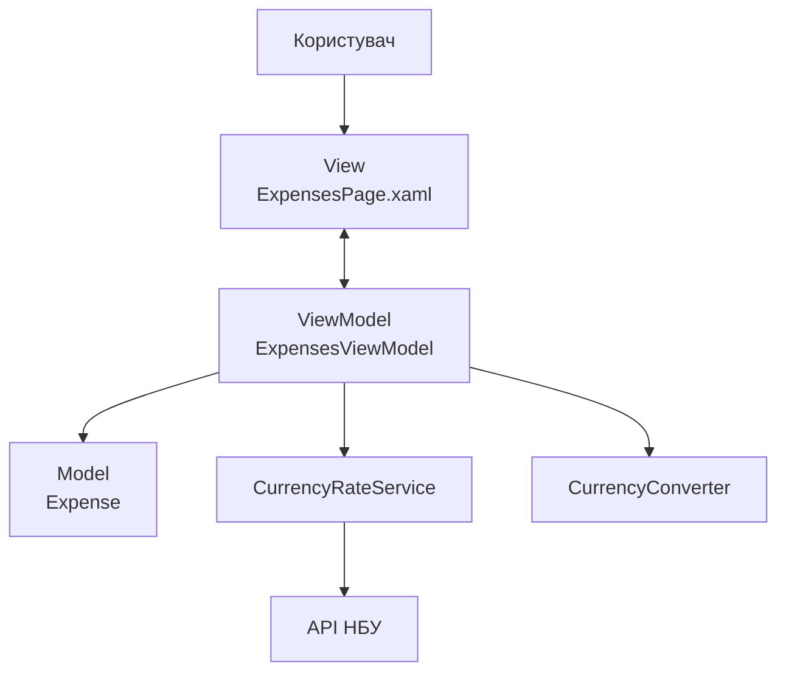
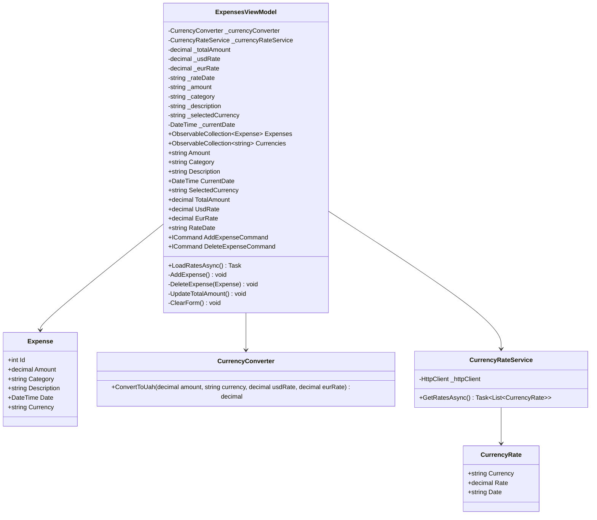
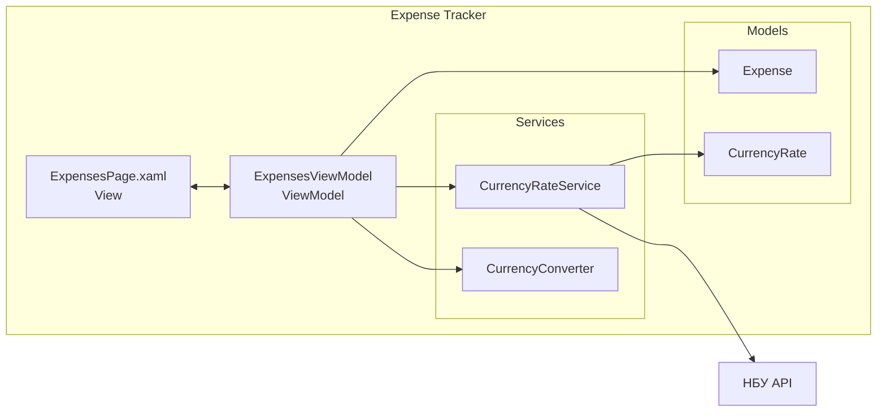
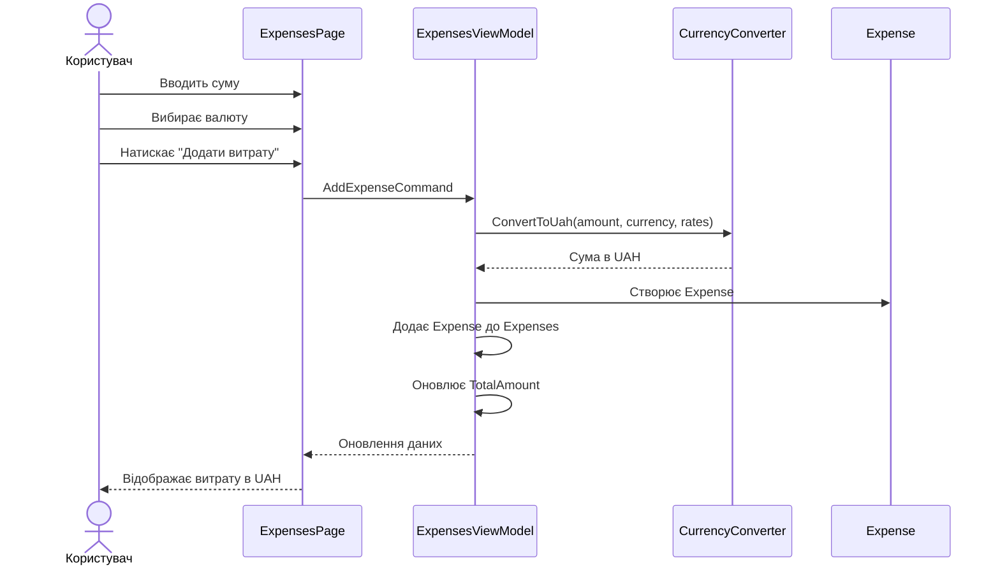
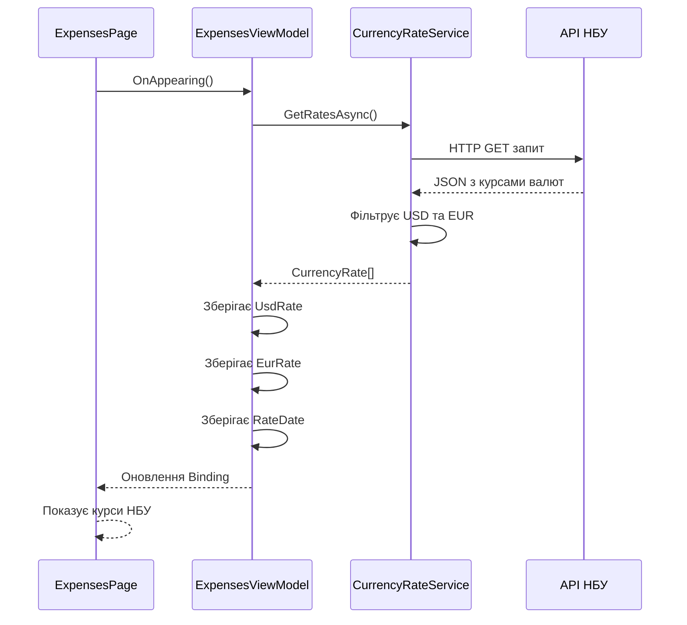
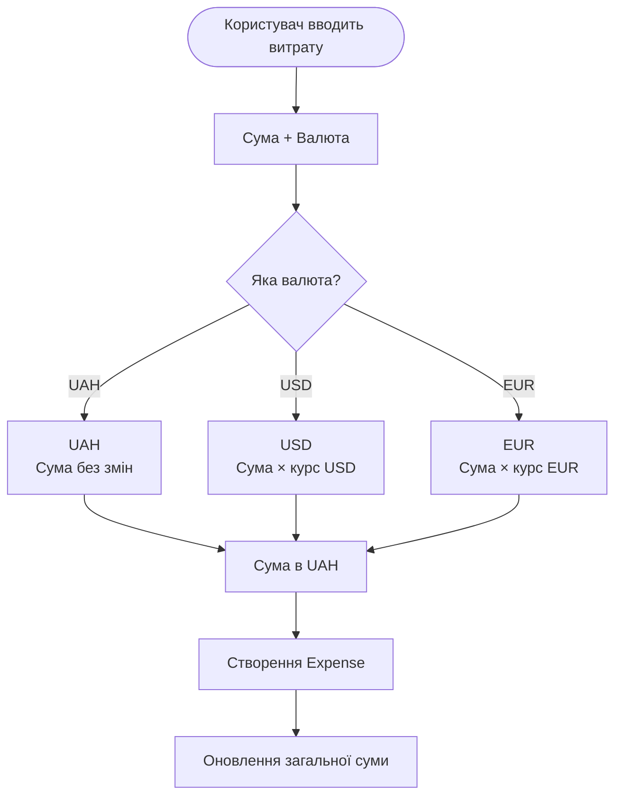
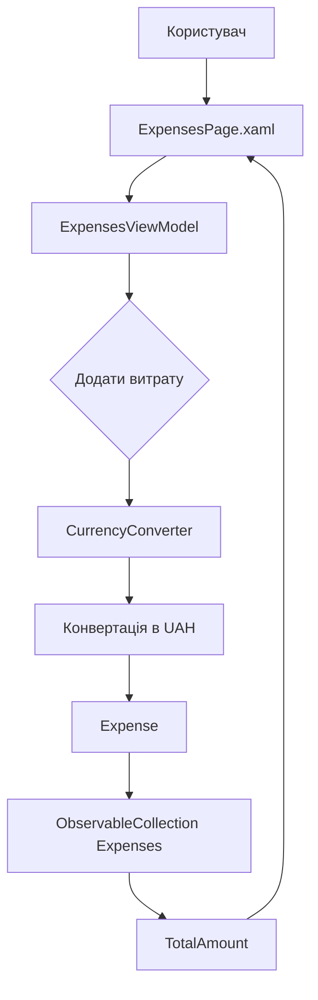
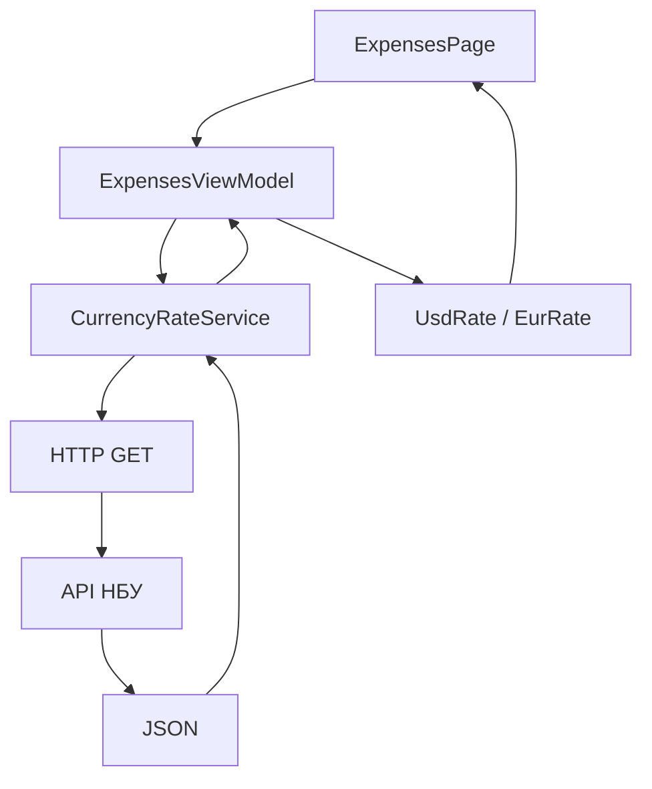

# Expense Tracker

Мобільний застосунок для обліку особистих витрат, розроблений на C# з використанням .NET MAUI та архітектурного патерну MVVM.

## Опис проєкту

Застосунок дозволяє користувачу додавати та видаляти витрати, вказувати суму, валюту, категорію, опис і дату витрати.

Якщо витрата введена в USD або EUR, застосунок автоматично конвертує її у гривні за актуальним офіційним курсом НБУ. Усі витрати в застосунку зберігаються та підсумовуються в UAH.

Актуальні курси USD та EUR отримуються через API Національного банку України.

## Основні можливості

- Додавання нової витрати.
- Вибір валюти витрати: UAH, USD або EUR.
- Автоматична конвертація USD та EUR у гривні.
- Отримання актуальних курсів валют з API НБУ.
- Відображення поточного курсу USD та EUR.
- Відображення дати курсу.
- Перегляд історії витрат.
- Видалення витрати.
- Автоматичний підрахунок загальної суми витрат у гривнях.

## Використані технології

- C#
- .NET MAUI
- XAML
- MVVM
- REST API
- JSON
- API Національного банку України

## Структура проєкту

```text
Lab1
│
├── Models
│   ├── Expense.cs
│   └── CurrencyRate.cs
│
├── ViewModels
│   └── ExpensesViewModel.cs
│
├── Views
│   ├── ExpensesPage.xaml
│   └── ExpensesPage.xaml.cs
│
├── Services
│   ├── CurrencyConverter.cs
│   └── CurrencyRateService.cs
│
├── App.xaml
├── App.xaml.cs
├── AppShell.xaml
└── AppShell.xaml.cs
````

## Архітектура MVVM

У застосунку використовується архітектурний патерн MVVM (Model-View-ViewModel).



### Model

Model відповідає за зберігання даних.

Основна модель `Expense` містить:

* Id
* Amount
* Category
* Description
* Date
* Currency

`CurrencyRate` використовується для представлення інформації про курс валюти.

### View

View відповідає за відображення інформації та взаємодію з користувачем.

Основна сторінка:

```text
ExpensesPage.xaml
```

На сторінці користувач може:

* переглядати загальну суму;
* переглядати курси валют;
* вводити нову витрату;
* вибирати валюту;
* переглядати історію витрат;
* видаляти витрати.

### ViewModel

`ExpensesViewModel` є посередником між View та іншими компонентами.

Він відповідає за:

* зберігання списку витрат;
* обробку команд;
* перевірку введених даних;
* отримання курсів валют;
* виклик конвертера;
* підрахунок загальної суми.

## UML діаграма класів



## UML діаграма компонентів



## UML діаграма послідовності додавання витрати

Під час додавання витрати користувач вводить суму та вибирає валюту. Якщо валюта відрізняється від гривні, сума конвертується в UAH.



## UML діаграма отримання курсів валют



## UML діаграма процесу конвертації



## Логіка роботи з валютами

Усі витрати після додавання зберігаються в гривнях.

Наприклад, якщо користувач вводить:

```text
Сума: 100
Валюта: USD
Курс: 41.50 UAH
```

застосунок виконує:

```text
100 × 41.50 = 4150 UAH
```

У моделі зберігається:

```text
Amount = 4150
Currency = UAH
```

Для EUR принцип такий самий:

```text
100 × курс EUR = сума в UAH
```

Якщо користувач вибирає UAH, конвертація не виконується:

```text
100 UAH = 100 UAH
```

## Взаємодія компонентів

Основний потік даних у застосунку:



Отримання курсу працює окремим потоком:



## Приклад роботи

Користувач відкриває застосунок.

Застосунок отримує актуальні курси USD та EUR з API НБУ та показує їх у верхній частині сторінки.

Після цього користувач вводить:

```text
Сума: 50
Валюта: EUR
Категорія: Їжа
Опис: Кафе
Дата: 02.10.2026
```

Після натискання кнопки "Додати витрату" програма бере курс EUR, конвертує 50 EUR у гривні та додає отриману суму до списку витрат.

У списку відображається вже гривнева сума.

## API НБУ

Для отримання офіційних курсів валют використовується API Національного банку України:

```text
https://bank.gov.ua/NBUStatService/v1/statdirectory/exchangenew?json
```

API повертає дані у форматі JSON.

Застосунок використовує:

```text
cc            Код валюти
rate          Курс
exchangedate  Дата курсу
```
